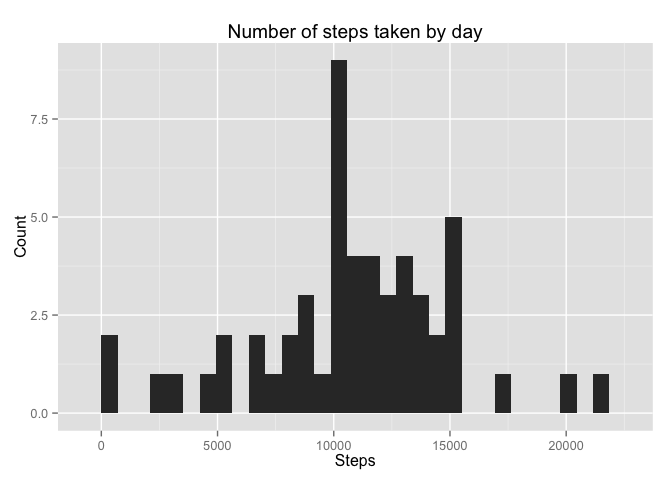
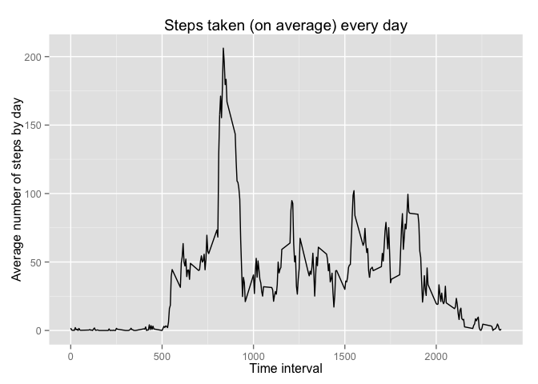
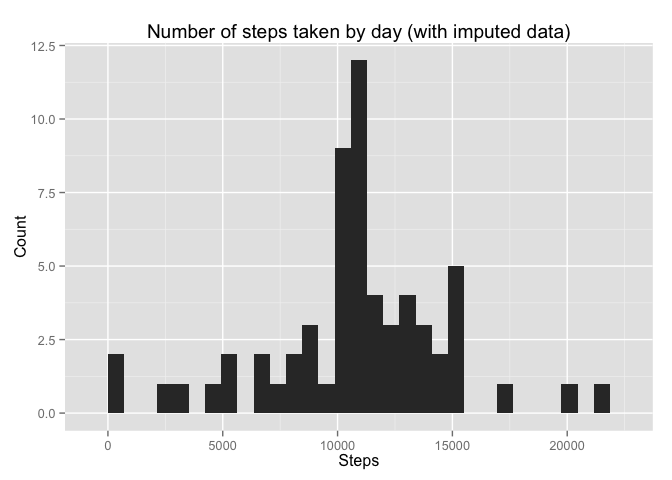
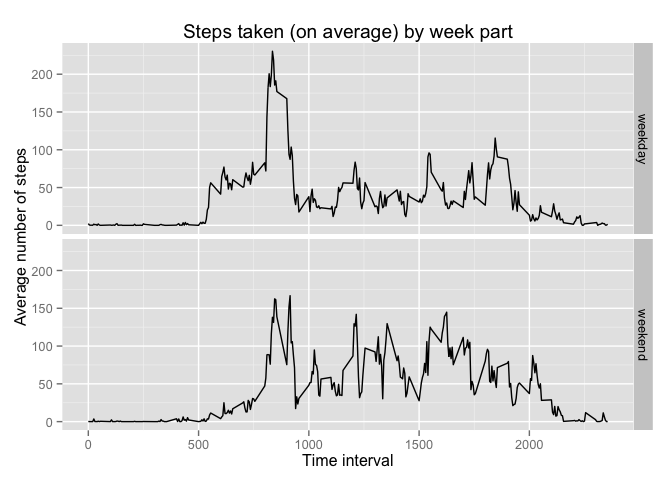

# Reproducible Research: Peer Assessment 1

## Loading and preprocessing the data

### 1) Code to unzip and load the "activity" dataset data.

```r
if (!file.exists("data")) {dir.create("data")}
unzip("activity.zip", exdir="./data")
data <- read.csv("data/activity.csv")
```

### 2) Preprocess of the data.

```r
data$date <- as.Date(data$date)
```

## What is mean total number of steps taken per day?

### 1) Histogram: Total number of steps taken by day.

```r
library(ggplot2)
stepsbyday <- aggregate(steps ~ date, data, sum)
ggplot(stepsbyday, aes(steps)) + geom_histogram() + labs(title="Number of steps taken by day", x="Steps", y="Count")
```

```
## stat_bin: binwidth defaulted to range/30. Use 'binwidth = x' to adjust this.
```

 

### 2) The mean and the median number of steps taken by day.

```r
mean(stepsbyday$steps, na.rm=TRUE)
```

```
## [1] 10766.19
```

```r
median(stepsbyday$steps, na.rm=TRUE)
```

```
## [1] 10765
```


## What is the average daily activity pattern?

### 1) Time series plot of the 5-minute interval and the average number of steps taken (averaged across all days)

```r
library(reshape2)
ave.steps <- dcast(data, interval ~ ., value.var="steps", na.rm=TRUE, mean)
ggplot(ave.steps, aes(ave.steps[,1], ave.steps[,2])) + geom_path() + labs(x="Time interval", y="Average number of steps by day", title="Steps taken (on average) every day")
```

 

### 2) 5-minute interval which contains the maximum number of steps on ave.steps.

```r
ave.steps[which.max(ave.steps[,2]), 1]
```

```
## [1] 835
```


## Imputing missing values

## 1) Total number of missing values in the dataset.

```r
sum(is.na(data$steps))
```

```
## [1] 2304
```

## 2) Strategy for filling in the missing data.

Replace all the missing value with their corresponding interval average (accross all days), which
information is available in the "ave.steps" data frame.

## 3) Filling in all of the missing values in the dataset, in a new dataset named "data_imputed".

```r
data_imputed <- data
l <- length(data$steps)
for (i in 1:l){
  interval <- data_imputed$interval[i];
  row<- which(ave.steps[,1]==interval); #Corresponding row in ave.steps data frame.
  if (is.na(data_imputed$steps[i])) data_imputed$steps[i] <- ave.steps[row, 2];
}
```

### 4-1) Histogram of steps taken by day according to data_imputed.


```r
stepsbyday_imputed <- aggregate(steps ~ date, data_imputed, sum)
ggplot(stepsbyday_imputed, aes(steps)) + geom_histogram() + labs(title="Number of steps taken by day (with imputed data)", x="Steps", y="Count")
```

```
## stat_bin: binwidth defaulted to range/30. Use 'binwidth = x' to adjust this.
```

 

### 4-2) Mean and median of data_imputed

```r
mean(stepsbyday_imputed$steps)
```

```
## [1] 10766.19
```

```r
median(stepsbyday_imputed$steps)
```

```
## [1] 10766.19
```

Do these values differ from the estimates from the first part of the assignment? 
No, they don't differ.

What is the impact of imputing missing data on the estimates of the total daily number of steps?
There is little impact, the means are the same and the medians differ in less than 1.5 steps.


## Are there differences in activity patterns between weekdays and weekends?

### 1) Creating a new factor variable indicating whether a given date is a weekday or weekend day in data_imputed.

```r
for (i in 1:l){
  if (weekdays(data_imputed$date[i])=="Saturday" | weekdays(data_imputed$date[i])=="Sunday") data_imputed$weekpart[i] <- 1 else data_imputed$weekpart[i] <- 0;
}
data_imputed$weekpart <- factor(data_imputed$weekpart, levels=c(0,1), labels=c("weekday", "weekend"))
```

### 2) Time series plot

```r
ave.steps_imputed <- dcast(data_imputed, interval + weekpart ~ ., value.var="steps", mean)
names(ave.steps_imputed) <- c("interval", "weekpart", "steps")
ggplot(ave.steps_imputed, aes(interval, steps)) + geom_path() + facet_grid(weekpart~.) + labs(x="Time interval", y="Average number of steps", title="Steps taken (on average) by week part")
```

 
